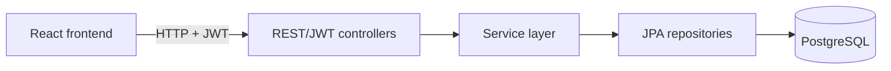

# StockFlow

**Enterprise Inventory, Order and Master Data Management Platform**

StockFlow is a full-stack business application built to model real inventory and order workflows. It combines a Spring Boot REST API with a React client and PostgreSQL persistence, with an emphasis on explicit business rules, layered architecture, secure access, and reliable automated testing.

Repository: [github.com/li8948552-del/stockflow](https://github.com/li8948552-del/stockflow)

## Current development status

### Implemented now

- Stateless JWT authentication, user registration, and role-based access control
- Structured sales orders with server-assigned line numbers, inventory reservation, cancellation, and immutable movement audit records
- Product master data with validated pricing, reorder points, activation status, and normalized unique SKUs
- Supplier and Warehouse master data with normalized unique business codes
- Transactional inventory management with immutable stock-movement audit records
- Authenticated master-data reads and `ADMIN`-only create, update, and deactivate operations
- React authentication and structured order workflows for users and administrators
- PostgreSQL persistence, OpenAPI documentation, and automated unit, controller, security, and JPA tests

### Currently under development

- Frontend management experiences for Product, Supplier, and Warehouse data

### Planned roadmap

Payment and shipment transitions, automatic reservation expiration, dashboards, and the remaining master-data UI are under development or planned. BI, ETL, Power BI, AI-assisted replenishment, and frontend inventory pages are not implemented.

## Engineering highlights

- Spring Boot layered architecture with REST controllers, DTOs, transactional services, JPA repositories, and domain entities
- Stateless JWT authentication and Spring Security role-based authorization
- Product, Supplier, Warehouse, and Inventory management
- Authenticated reads with `ADMIN`-only write operations
- Soft deletion for Product, Supplier, and Warehouse records by setting `active` to `false`
- Transactional service operations and database-level named unique constraints
- Shared normalization for SKUs and business codes using Unicode-aware boundary whitespace handling and `Locale.ROOT` uppercasing
- Validation against normalized Unicode code-point limits rather than UTF-16 code units
- DTO/entity separation so JPA entities are not exposed directly by master-data APIs
- Constraint-specific duplicate handling that does not misclassify unrelated persistence failures
- Transactionally atomic Inventory updates and append-only `InventoryMovement` audit records
- `@Version` optimistic locking for inventory updates and a fixed Warehouse → Product `PESSIMISTIC_WRITE` lock order for receipts
- Structured order forms support warehouse/product selection, multiple items, available-quantity hints, exact estimated totals, order detail views, cancellation, and ADMIN filtering across all orders
- OrderItem `lineNumber` preserves request/display order while inventory locks remain sorted by stable product identifiers
- Deterministic Java 25 Mockito execution through an explicitly resolved, portable Maven Surefire Java agent
- 248 backend tests and 85 frontend tests (14 files) verified with 0 failures

The Order module is now a structured sales-order foundation. It captures warehouse fulfilment, line items, price snapshots, reservations, and cancellation; payment, shipment, and expiration business workflows remain future work.

## Architecture



## Technology stack

| Area | Technology | Repository version |
| --- | --- | --- |
| Language | Java | 25 |
| Backend | Spring Boot | 4.1.0 |
| Security | Spring Security | Managed by Spring Boot 4.1.0 |
| Persistence | Spring Data JPA / Hibernate | Managed by Spring Boot 4.1.0 |
| Database | PostgreSQL | 18.4 Docker image |
| Frontend | React | 19.2.8 |
| UI components | Mantine | 9.4.2 |
| Backend build | Maven Wrapper / Maven | Wrapper 3.3.4 / Maven 3.9.16 |
| Frontend tooling | npm | Lockfile version 3 |
| Containers | Docker Compose | Compose specification in `compose.yaml` |
| Backend testing | JUnit and Mockito | Managed by Spring Boot 4.1.0 |
| Frontend build/test | Vite / Vitest | 8.1.5 / 4.1.10 |

## Domain modules

| Module | Status | Purpose |
| --- | --- | --- |
| Authentication/User | Implemented | Signup, login, JWT issuance, current-user access, and administrative user management |
| Structured Sales Orders / Stock Reservation | Implemented | Order and OrderItem aggregates, server-assigned line numbers, price snapshots, reservation and cancellation workflow |
| Product | Implemented | Product identity, normalized SKU, price, reorder point, active status, and timestamps |
| Supplier | Implemented | Supplier identity, normalized code, contact details, lead time, active status, and timestamps |
| Warehouse | Implemented | Warehouse identity, normalized code, location, active status, and timestamps |
| Inventory | Implemented | Per-product, per-warehouse on-hand and reserved quantities with calculated availability and optimistic locking |
| InventoryMovement | Implemented | Immutable audit history for stock changes, reservations, releases, and adjustments |

## Business rules

- `sku`, `supplierCode`, and `warehouseCode` are normalized by removing Unicode boundary whitespace and uppercasing with `Locale.ROOT`.
- Normalized identifiers must be nonblank and no longer than 64 Unicode code points. Internal whitespace is preserved.
- Identifier uniqueness is protected by service pre-checks and explicit database unique constraints.
- Product prices are nonnegative `numeric(19,2)` values. Requests allow at most 17 integer digits and two fractional digits without silent rounding.
- Product reorder points are nonnegative. Supplier lead times must be between 0 and 3650 days.
- Product, Supplier, and Warehouse deletion endpoints perform soft deletion by setting `active` to `false`.
- Master-data reads require authentication; create, update, and deactivate operations require the `ADMIN` role.
- DTO validation, service validation, entity setters and lifecycle callbacks, Jakarta entity validation, and database constraints provide defense in depth.
- Only violations of the relevant named unique constraint are translated into duplicate-identifier conflicts.
- Each Product/Warehouse pair has one Inventory record, with `available = onHand - reserved` calculated rather than persisted.
- Inventory quantities remain nonnegative, and `reserved` cannot exceed `onHand`.
- Inventory uses `@Version` optimistic locking. Receipts use a fixed Warehouse → Product `PESSIMISTIC_WRITE` row-lock order to prevent concurrent first-receipt races and deadlocks.
- Every inventory change and its `InventoryMovement` are written in one transaction, so both commit or both roll back.
- Sales-order creation increases `reserved` without changing `onHand`; cancellation releases `reserved` without changing `onHand` and records `RESERVATION` / `RELEASE` movements.
- Orders use `BigDecimal` calculations, Product price snapshots, and exact decimal-string JSON amounts. Their model includes `RESERVED`, `PAID`, `SHIPPED`, `CANCELLED`, and `EXPIRED`; only create → `RESERVED`, `RESERVED` → `CANCELLED`, and idempotent repeated cancellation are currently implemented.
- Order writes use User → Warehouse → Product → Inventory locking; receipts use Warehouse → Product → Inventory; cancellation uses Order → Warehouse → Product → Inventory.

## API overview

All secured endpoints expect `Authorization: Bearer <token>`. Interactive OpenAPI documentation is available at `http://localhost:8080/swagger-ui.html` while the backend is running.

| Method | Path | Access | Behavior |
| --- | --- | --- | --- |
| `POST` | `/auth/authenticate` | Public | Authenticate and issue a JWT |
| `POST` | `/auth/signup` | Public | Register a `USER` account and issue a JWT |
| `GET` | `/public/numberOfUsers` | Public | Return the user count |
| `GET` | `/public/numberOfOrders` | Public | Return the order count |
| `GET` | `/api/users/me` | Authenticated | Return the current user |
| `GET` | `/api/users` | `ADMIN` | List users |
| `GET` | `/api/users/{username}` | `ADMIN` | Get a user by username |
| `DELETE` | `/api/users/{username}` | `ADMIN` | Delete a user, subject to admin safety rules |
| `GET` | `/api/orders` | Authenticated (`USER` sees own; `ADMIN` sees all with supported filters) | List structured sales orders |
| `GET` | `/api/orders/{id}` | Authenticated, ownership-aware | Get one structured order |
| `POST` | `/api/orders` | Authenticated | Create an order and reserve inventory |
| `POST` | `/api/orders/{id}/cancel` | Owner or `ADMIN` | Cancel a `RESERVED` order and release reservations (idempotent) |
| `GET` | `/api/products` | Authenticated | List products |
| `GET` | `/api/products/{id}` | Authenticated | Get a product |
| `POST` | `/api/products` | `ADMIN` | Create a product |
| `PUT` | `/api/products/{id}` | `ADMIN` | Update a product |
| `DELETE` | `/api/products/{id}` | `ADMIN` | Deactivate a product |
| `GET` | `/api/suppliers` | Authenticated | List suppliers |
| `GET` | `/api/suppliers/{id}` | Authenticated | Get a supplier |
| `POST` | `/api/suppliers` | `ADMIN` | Create a supplier |
| `PUT` | `/api/suppliers/{id}` | `ADMIN` | Update a supplier |
| `DELETE` | `/api/suppliers/{id}` | `ADMIN` | Deactivate a supplier |
| `GET` | `/api/warehouses` | Authenticated | List warehouses |
| `GET` | `/api/warehouses/{id}` | Authenticated | Get a warehouse |
| `POST` | `/api/warehouses` | `ADMIN` | Create a warehouse |
| `PUT` | `/api/warehouses/{id}` | `ADMIN` | Update a warehouse |
| `DELETE` | `/api/warehouses/{id}` | `ADMIN` | Deactivate a warehouse |
| `GET` | `/api/inventory?productId={id}&warehouseId={id}&lowStock={boolean}` | Authenticated | List inventory with optional product, warehouse, and low-stock filters |
| `GET` | `/api/inventory/{id}` | Authenticated | Get one inventory record |
| `POST` | `/api/inventory/receipts` | `ADMIN` | Receive stock, creating initial inventory when necessary |
| `POST` | `/api/inventory/{id}/adjustments` | `ADMIN` | Apply a reasoned positive or negative on-hand adjustment |
| `GET` | `/api/inventory/{id}/movements` | Authenticated | List inventory movements in stable reverse-chronological order |

## Project structure

```text
stockflow/
├── compose.yaml
├── order-api/
│   ├── pom.xml
│   └── src/
│       ├── main/
│       │   ├── java/com/ivanfranchin/orderapi/
│       │   │   ├── config/            # OpenAPI and error configuration
│       │   │   ├── inventory/         # Inventory, movements, transactions, and persistence
│       │   │   ├── order/             # Order foundation
│       │   │   ├── product/           # Product domain and persistence
│       │   │   ├── rest/              # Controllers and request/response DTOs
│       │   │   ├── security/          # JWT authentication and authorization
│       │   │   ├── supplier/          # Supplier domain and persistence
│       │   │   ├── user/              # User domain and persistence
│       │   │   ├── validation/        # Shared business-code validation
│       │   │   └── warehouse/         # Warehouse domain and persistence
│       │   └── resources/application.yml
│       └── test/                       # Unit, controller, security, and JPA tests
└── order-ui/
    ├── package.json
    ├── package-lock.json
    └── src/
        ├── components/
        │   ├── admin/
        │   ├── context/
        │   ├── home/
        │   ├── misc/
        │   └── user/
        ├── App.jsx
        └── index.jsx
```

## Getting started

### Prerequisites

- Java 25
- Docker with Docker Compose
- Node.js compatible with Vite 8 (`20.19+`, `22.12+`, or `24+`)
- npm
- Git

### Clone and start PostgreSQL

```bash
git clone https://github.com/li8948552-del/stockflow.git
cd stockflow
docker compose up -d
```

Docker Compose starts PostgreSQL 18.4 on `localhost:5432` with the database and development credentials declared in [`compose.yaml`](compose.yaml).

### Start the backend

From a terminal opened in the directory that contains the cloned `stockflow` folder:

```bash
cd stockflow/order-api
./mvnw spring-boot:run
```

The API runs at `http://localhost:8080`; Swagger UI is available at `http://localhost:8080/swagger-ui.html`.

### Start the frontend

From a second terminal opened in the directory that contains the cloned `stockflow` folder:

```bash
cd stockflow/order-ui
npm install
npm start
```

The frontend runs at `http://localhost:3000` and is allowed by the backend's default CORS configuration.

On an empty database, the application creates these development accounts:

| Role | Username | Password |
| --- | --- | --- |
| `ADMIN` | `admin` | `admin` |
| `USER` | `user` | `user` |

New `USER` accounts can also be created through `/auth/signup`.

## Testing

Run backend commands from `order-api`:

```bash
# Formatting verification
./mvnw spotless:check

# Focused Inventory and shared-text tests
./mvnw -Dtest='Inventory*Test,BusinessTextTest' test

# Complete backend suite
./mvnw clean test
```

The current backend suite contains **248 tests** and the frontend suite contains **85 tests across 14 files**, all passing.

Build the frontend from `order-ui`:

```bash
npm install
npm run build
```

## Roadmap

### Completed

- [x] Project rebrand and standalone repository
- [x] Authentication/RBAC foundation
- [x] Product management
- [x] Supplier management
- [x] Warehouse management
- [x] Inventory and `InventoryMovement`
- [x] Stock receipt, adjustment, and audit history
- [x] Optimistic locking and concurrency-safe initial stock creation

### Planned

- [x] Structured sales orders and stock reservation
- [ ] Payment and shipment transitions
- [ ] Automatic reservation expiration
- [ ] Dashboard and remaining master-data UI
- [ ] Dimensional warehouse/ETL and Power BI
- [ ] AI replenishment assistant
- [ ] Deployment and demo

## Project evolution and attribution

StockFlow is developed and maintained by [Hexin Li](https://github.com/li8948552-del). The project began with the authentication and basic order-management foundation from the MIT-licensed [ivangfr/springboot-react-jwt-token](https://github.com/ivangfr/springboot-react-jwt-token) project and has since been substantially extended with independent domain modelling, validation, persistence, security, and testing work.

This is a standalone repository. The original MIT license and upstream copyright remain in [`LICENSE`](LICENSE).

## Author and license

- Author: [Hexin Li](https://github.com/li8948552-del)
- License: [MIT License](LICENSE)
